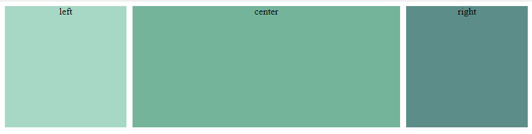
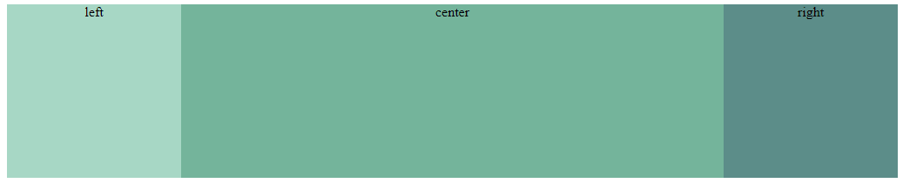

# CSS 实现三栏布局的 3 种方式

## 需求描述

三栏布局在我们生活中很常见，一般要求的是两边宽度固定，中间自适应宽度。
假设我们有如下`html`代码，要求实现三栏布局。

```html
<div class="column-container">
  <div class="column left">left</div>
  <div class="column center">center</div>
  <div class="column right">right</div>
</div>
```

结果如下：



最简单是方式是用 flex 或者 grid。他们被设计出来的目的就是应付这类场景的。

## 1. grid 实现

通过把最外层设置为 grid 布局。再把内容划分为三列,中间列的宽度为`auto`，如果我们还需要设置每列的间距，还可以利用`column-gap`属性。代码如下：

```css
.column-container {
  display: grid;
  grid-template-columns: 200px auto 200px;
  column-gap: 10px;
}
```

## 2. flex 实现

设置`container`为 flex 布局，左右宽度固定后，中间列加上`flex: 1`属性，代码如下：

```css
.column-container {
  display: flex;
  column-gap: 10px;
}
.left,
.right {
  width: 200px;
}
.center {
  flex: 1;
}
```

flex 还有个很有意思的属性是`order`,假设 HTML 代码如下，需要把 center 放在中间。

```css
<div class="column-container">
  <div class="center">center</div>
  <div class="left">left</div>
  <div class="right">right</div>
</div>
```

我们可以通过设置`order`属性来对 flex 里面的内容进行排序。

```css
.left {
  order: 0;
}
.center {
  order: 1;
}
.right {
  order: 2;
}
```

## 3. 传统的 float 布局

这个方法我们现在已经不推荐了，原因如下：
1. 代码实现起来不简洁
2. 灵活性也比较低,加边距的时候麻烦。
3. 在响应式这块适配比较查。
   
不过我们也可以通过和之前的`flex,grid`两种方法进行对比，结果如下：


代码实现：

```css
.left {
  width: 200px;
  float: left;
}
.right {
  width: 200px;
  float: right;
}
.center {
  width: 100%;
}
```
