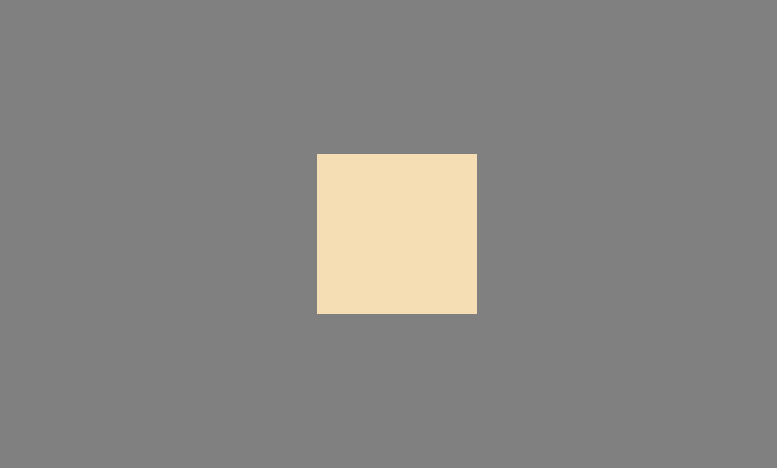

# CSS 实现垂直居中的 8 种方式

## 需求描述
假设我们有如下初始代码，要求实现`content`在`container`中是垂直居中的。
```javascript
<div class="container">
  <div class="content"></div>
</div>

.container {
  background-color: gray;
  height: 30rem; /* 高度可以随意变化  */
}
.content {
  background-color: wheat;
  height: 10rem;
  width: 10rem;
}
```
## 最终效果：



## 1.用`margin: auto`的方法

原理：

- margin: auto 常用于设置水平居中。它会为元素自动填充可用空间。
  但是对于以下情况不起作用：

| 元素     | Position       |
| -------- | -------------- |
| 内联元素 | float          |
| 浮动元素 | inline         |
| 块级元素 | absulute/fixed |

- 当我们通过通过 position:absolute 和 top:0 bottom:0 来给元素的垂直方向拓展设置可用空间， 那么该元素可自动填充父级元素的可用尺寸。
- 代码实现：

```css
.container {
  position: relative; /* 设置父元素position为relative */
}
.content {
  position: absolute;
  top: 0; /* 设置四个方向是位置为0  */
  left: 0;
  right: 0;
  bottom: 0;
  margin: auto; /* 利用margin: auto实现垂直居中  */
}
```

## 2. 用`top: 50%;`+`translateY(-50%)`

- 原理：
  这种方式实现起来比较简单，但是前提是不需要做别的`transform`改动。

- 代码实现：

```css
.container {
  position: relative; /* 设置父元素position为relative */
}
.content {
  position: absolute;
  top: 50%; /* 设置子元素的起始位置为父元素垂直方向50%的位置 */
  transform: translateY(-50%); /* 再往上平移子元素高度的50% */
  /* 这两条可以同时实现水平居中
  transform: translate(-50%, -50%);
  left: 50% */
}
```

## 3. `display: flex`+`margin: auto`

- 原理：
  flex 容器中默认存在两根轴：主轴和交叉轴。默认的主轴是水平轴。通过控制子元素对这两根轴的对齐方式。可以比较轻松地实现居中。
  将父元素设置为 flex 容器，再加上`margin: auto`来同时实现水平和垂直居中。这个方法可以说是最简单的。
- 代码实现：

```css
.container {
  display: flex; /* 设置父元素设置为flex容器 */
}
.content {
  margin: auto;
}
```

## 4. 通过设置`flex`容器的`justify-content`和`align-items`两个属性来实现

- 原理：
  flex 布局中的两个属性`justify-content`：定义了元素在主轴的对齐方式， `align-items`：定义了元素在交叉轴的对齐方式。
  通过把两个对齐方式都设置为`center`,来实现居中对齐
- 代码实现

```css
.container {
  display: flex;
  justify-content: center;
  align-items: center;
}
```

## 5. 通过设置`flex`中子元素的`align-self`属性

- 原理：

在 flex 布局中，可以通过设置子元素的`align-self`来单独定义对齐方式。它和`align-items`的区别是：它是定义在子元素上，会覆盖 flex 容器中定义的`align-items`属性

- 代码实现
-

```css
.container {
  display: flex; /* 设置父元素设置为flex容器 */
}
.content {
  align-self: center;
  margin: 0 auto; /* 实现水平居中,flex布局不支持justify-self */
}
```

## 6. `grid`布局+`margin:auto`

- 原理
  grid 网格布局，将元素分为行和列，是一种二维布局。它常用于实现我们现在流行的瀑布流显示模式。
  在实现居中上，它和 flex 布局实现居中的原理很像。先确认容器，然后再通过相应属性来设置子元素的对齐方式。

- 代码实现

```css
.container {
  display: grid;
}
.content {
  margin: auto;
}
```

## 7. `grid`布局，设置容器的`align-content`和`justify-items`

- 原理
  `justify-content`属性设置整个内容区域在容器里面的水平位置，`align-content`属性设置整个内容在容器的垂直位置。

- 代码实现

```css
.container {
  display: grid;
  align-items: center;
  justify-content: center;
}
```

## 8. `grid`布局中单独设置子元素的对齐方式

- 代码实现

```css
.container {
  display: grid;
}
.content {
  justify-self: center; /*  设置子元素垂直居中 */
  align-self: center; /* 设置子元素水平居中*/
}
```

## 总结：
无论是垂直居中或者水平居中，要点是：

- 先确认参照物，比如说`position:relative`的父元素,flex 容器或者 grid 容器，甚至还有我们这篇文章中没有提到的 table 布局
- 再根据参照物进行居中，一个是通过`marin：auto`来对可用空间的自动填充。或者是通过一些控制对齐的属性来实现居中。
