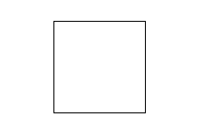
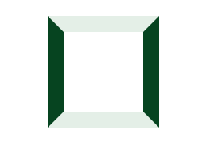
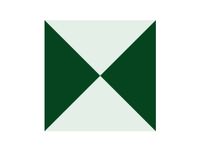

# CSS怎么画三角形

## 画三角形的原理

我们画三角形是通过 border 这个样式来画的。平常的 border 在你们眼中可能是这样的



当我们把 border 宽度增加后，我们可以看到相邻的 border 直接是像我们平时常见的相框，窗框一样连接起来的。



那么，当我们内容的宽度设为 0 之后。就变成了这样，这个图会不会回想起小时候做的一道题“数数里面一共有多少个三角形”？



这时候，我们再去画三角形就简单了。只需要把你需要的三角形那个区域填充好颜色，再把别的部分都设置为透明就好。

html 代码

```html
<div class="triangle-box"></div>
```

## 正三角形

要画一个正三角形，那么我们需要把 top, left, right 的这三个边都设置为透明

代码实现：

```css
.triangle-box {
  width: 0;
  height: 0;
  border: solid 30px;
  border-color: transparent transparent #064420 transparent;
}
```

## 倒三角形

同理，把 bottom, left, right 这三个边设置为透明，top 填充为我们需要的颜色


```css
.triangle-box {
  border-color: #064420 transparent transparent transparent;
}
```

## 不同高度的三角形

在画出三角形之后，我们还可以通过改变 border 的宽度，来实现不同高低的三角形。


代码实现：

```css
.triangle-box {
  width: 0;
  height: 0;
  border: solid transparent 30px;
  border-bottom-width: 15px; /*可以设置不同的宽度来实现不同高矮的三角形 */
  border-bottom-color: #064420;
}
```

## 直角三角形

1. 我们可以把两个相邻的三角形合并起来，就会得到一个大的直角三角形

```css
.triangle-box {
  width: 0;
  height: 0;
  border: solid 30px transparent;
  border-bottom-color: #064420;
  border-right-color: #064420;
}
```

2. 我们可以把相邻的边给删除，而不是设置为透明，这样可以得到一个小的直角三角形

```css
.triangle-box {
  width: 0;
  height: 0;
  border: solid 30px transparent;
  border-bottom-color: #064420;
  border-right: none;
}
```

# 总结

对于 CSS 画三角形，首先我们先明白这个的 border 的原理。之后就像是玩拼积木或者是涂色游戏一样。可以根据你的需求去创造不同的三角形。建议大家自己试试。
