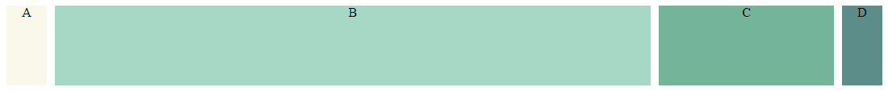

# 介绍CSS中的长度单位fr

## 简介

在 CSS Grid 网格布局中，引入了一种新的长度单位 `fr(fraction)`。它表示 Grid 布局中中剩余空间(leftover space)的一部分(fraction)。
一般来说 `1fr` 的意思是“100%的剩余空间”, `.25fr` 意味着“25%的剩余空间”。当时当 `fr` 大于 1 的时候，则会重新计算比例来分配。我们可以看下面的详细例子。

## 用法

### 1. 均分剩余空间

首先我们先建立如下的网格布局

```html
<div class="grid-container">
  <div class="A">A</div>
  <div class="B">B</div>
  <div class="C">C</div>
  <div class="D">D</div>
</div>
```

然后将 ABCD 四块进行均分，我们可以用 `grid-template-columns: repeat(4, 1fr)` 这里的和 `grid-template-columns: repeat(4, .25fr)` 效果是一样的。`.25` 来自于 `100%/4=25%`。

一般都建议使用 `fr>=1` 的情况, 比如说 `1fr 2fr` 就比 `.33fr .67fr` 可读性更强。

实现效果如下：

```css
.grid-container {
  display: grid;
  grid-template-columns: repeat(4, 1fr);
  column-gap: 10px;
}
```


### 2. 和其他单位混合使用

在 grid 布局中，有时候我们需要固定某些列的长度，可以用以下方法，这里 `A` 和 `D` 都是固定的 `50px`，`C` 是占总宽度的 `20%`，剩余空间就可以分配给 `B`。
这种情况，在设计响应式布局的时候非常有用。

```css
.grid-container {
  grid-template-columns: 50px 1fr 20% 50px;
  column-gap: 10px;
}
```


