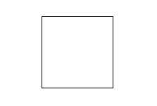
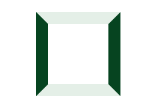
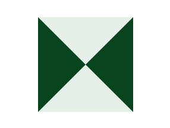

# CSS 怎么画正三角和倒三角形

## 画三角形的原理

   我们画三角形是通过 border 这个样式来画的。平常的 border 在你们眼中可能是这样的
   

   当我们把 border 宽度增加后，我们可以看到相邻的 border 直接是像我们平时常见的相框，窗框一样连接起来的。
   

   那么，当我们内容的宽度设为 0 之后。就变成了这样，这个图会不会回想起小时候做的一道题“数数里面一共有多少个三角形”？
   
   
   这时候，我们再去画三角形就简单了。只需要把你需要的三角形那个边填充好颜色，再把别的部分都设置为透明就好。

## 画正三角

