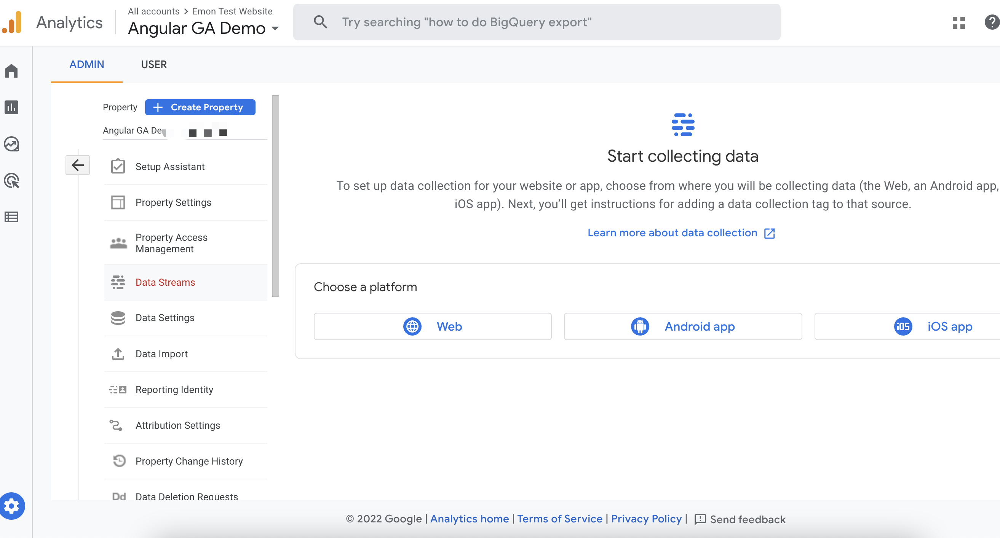

# Angular网站集成Google Analytics
## 什么是Google Analytics
Google Analytics(以下简称GA)是一个由Google提供的免费的服务，它可以从你的网站或者app收集数据，来创建报告而进一步改进业务。
## 在Angular网站里使用GA
像Angular这样的前段框架，在前端开发中给我们带来了很多便利。但是由于她他们都属于单页面应用(Single-page application, 以下简称SPA), 所以在做SEO或者集成类似GA这些服务的时候，需要做一些额外的工作。

## 设置Google Analytics账号
1. 进入 [Google Analytics 官网](https://analytics.google.com/analytics/web/)，登录或者创建一个账号。
2. 创建一个新的Account,再创建新的property。

3. 根据你的项目类型（APP或者Website）来创建stream


4. 设置好了之后，GA会生成一个MEASUREMENT ID，之后我们就可以集成GA tag 到我们的应用中了。


## 集成Google Analytics 到Angular网站
目前主要有两种方法来在Angular网站中集成GA：
1. 用GA官方文档中的集成方式
- 当你设置好data stream之后，根据GA官方的介绍，我们需要把下面这些JS代码写到`index.html`文件中的<head>之后。记得把`MEASUREMENT ID`替换成你data stream的`MEASUREMENT ID`
``` javascript
<!-- Google tag (gtag.js) -->
<script async src="https://www.googletagmanager.com/gtag/js?id=MEASUREMENT ID"></script>
<script>
  window.dataLayer = window.dataLayer || [];
  function gtag(){dataLayer.push(arguments);}
  gtag('js', new Date());

  gtag('config', 'MEASUREMENT ID');
</script>
```
- 但是对于Angular框架这样的SPA,在切换路由的时候，GA并不会捕捉到这个事件。我们需要在`app.component.ts`的`constructor()`中添加如下代码， 以便在每次跳转的时候，手动调用gtag方法来增加记录。

``` javascript
export class AppComponent {
  constructor(public router: Router) {
    this.router.events.subscribe((event) => {
      if (event instanceof NavigationEnd) {
        gtag('config', 'MEASUREMENT-ID', { 'page_path': event.urlAfterRedirects });
      }      
    })
  }
}
```

2. 用开源的第三方库。
这个比较省心，一键安装。但是同时，也会有一些限制，比如说你无法根据自己的需求，随时开关GA。
- [Ngx Google Analytics](https://www.npmjs.com/package/ngx-google-analytics)
- [angular-google-analytics](https://www.npmjs.com/package/angular-google-analytics)

## 参考文档

- [Angular & Google Analytics - The Complete Guide](https://danielk.tech/home/angular-and-google-analytics)
