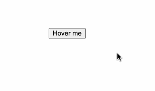

# 用popperjs实现一个Angular的tooltip组件

##  PopperJS
[PopperJS](https://popper.js.org/)是一个轻量级的JavaScript库，它专门用来创建弹出式（popper）元素，例如提示框，下拉菜单等。它能确保弹出式元素在页面上准确地定位和对齐。
在很多UI框架，包括Bootstrap, Foundation, Material UI, 都使用到了Popperjs来帮助元素定位。
## 用popperjs实现一个Angular的tooltip组件
### 需求描述
有时候自己网站中，想要使用tooltip，但是为了兼顾性能，不想引入Bootstrap这些大型的UI框架，就可以尝试自己使用PopperJs来简单实现一个公用的 tooltip component

### Demo

### 代码实现
参考PopperJS的官方文档(https://popper.js.org/docs/v2/)，我们先建一个tooltip component。
   
1. HTML部分，代码很少，这里展示了完成基础功能的代码。首先定义一个`tooltip`容器，包含内容`<ng-content>`以及提示框上的小箭头`arrow`，`<ng-content>`可以接收用户传进来的tooltip内容。
```
<div #tooltip id="tooltip" role="tooltip">
    <ng-content></ng-content>
    <div id="arrow" data-popper-arrow></div>
</div>
```

2. ts部分，主要包括三个方法， 分别是初始化tooltip`initPopper()`，显示tooltip的事件`show()`以及隐藏tooltip的事件`hide()`
```
export class TooltipComponent implements AfterViewInit {
  @Input() target!: HTMLElement;
  @ViewChild('tooltip') tooltip!: ElementRef;
  popperInstance: any;

  ngAfterViewInit(): void {
    if (this.target && this.tooltip) {
      this.initPopper();
    }
  }
  initPopper() {
     this.popperInstance = createPopper(
      this.target,
      this.tooltip.nativeElement,
      {
        modifiers: [
          {
            name: 'offset',
            options: {
              offset: [0, 8],
            },
          },
        ],
      }
    );

    const showEvents = ['mouseenter', 'focus'];
    const hideEvents = ['mouseleave', 'blur'];

    showEvents.forEach((event) => {
      this.target.addEventListener(event, this.show.bind(this));
    });

    hideEvents.forEach((event) => {
      this.target.addEventListener(event, this.hide.bind(this));
    });
  }

  show() {
    // Make the tooltip visible
    this.tooltip.nativeElement.setAttribute('data-show', '');

    // Enable the event listeners
    this.popperInstance.setOptions((options: any) => ({
      ...options,
      modifiers: [
        ...options.modifiers,
        { name: 'eventListeners', enabled: true },
      ],
    }));

    // Update its position
    this.popperInstance.update();
  }

  hide() {
    // Hide the tooltip
    this.tooltip.nativeElement.removeAttribute('data-show');

    // Disable the event listeners
    this.popperInstance.setOptions((options: any) => ({
      ...options,
      modifiers: [
        ...options.modifiers,
        { name: 'eventListeners', enabled: false },
      ],
    }));
  }
}
```
3. CSS部分，包括了对tooltip的内容样式的一些调整，具体代码可以参考完整的项目地址：https://github.com/emonZan/popper-tooltip
4. 使用方法如下。
```
  <button #buttonRef>Hover me</button>
  <app-tooltip [target]="buttonRef">
  <!-- tooltip content -->
  <p>hello!</p>
  <p>this is a tooltip</p>
  </app-tooltip>
```

### 功能拓展
根据popperjs的官方文档，我们可以对tooltip的弹出位置，偏移量，以及是否有箭头等进行定制，因此可以根据具体需求，进一步完善这个tooltip 组件。

#### 源代码
https://github.com/emonZan/popper-tooltip
