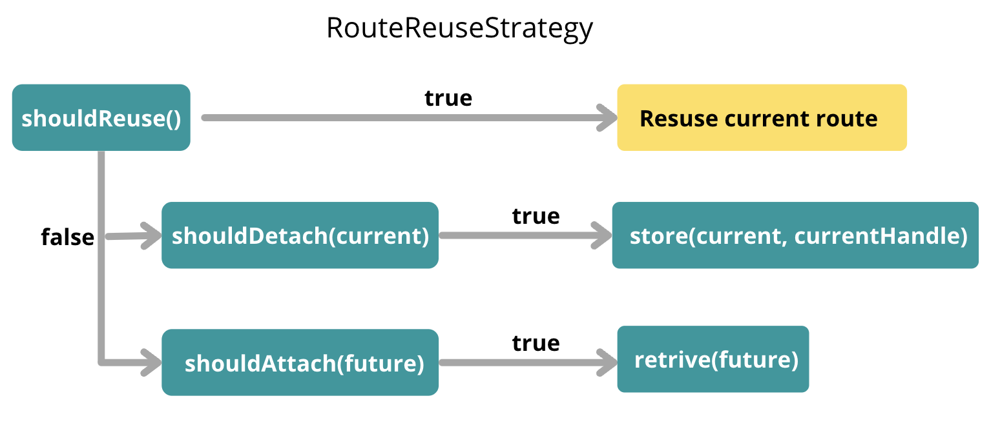

# 详解Angular中的RouteReuseStrategy

RouteReuseStrategy， 字面意思就是“路由复用策略”。在Angular website中，当你从一个页面导航到另一个页面，一般都是用路由来实现。这时候，如果你希望保持前一个页面的数据和状态，就需要用到RouteReuseStrategy。
比如说，你有一个搜索页面A，已经加载了几百上千条数据。现在你要跳转到页面B，但是你希望保留页面A的搜索结果，因为如果回到页面A时，重新搜索的话，需要花费很多时间。

## RouteReuseStrategy的实现方式
RouteReuseStrategy接口有5个方法，具体可以参考Angular的官方文档: [RouteReuseStrategy](https://angular.io/api/router/RouteReuseStrategy)

假设我们要从PageA跳转到PageB, 一下是5个方法具体调用时间以及对应的作用。
1. `shouldDetach(route: ActivatedRouteSnapshot): boolean` 每次进行跳转的时候都会被调用。判断PageA路由是否应该被detach,以备之后重用。
2. `store(route: ActivatedRouteSnapshot, handle: DetachedRouteHandle): void` 在`shouldDetach()`返回值为`true`之后调用。存储detach(这里指PageA)的路由信息。
3. `shouldAttach(route: ActivatedRouteSnapshot): boolean` 每次跳转时调用，判断判断一个路由是否应该被reattach,这里的判断对象是PageB。
4. `retrieve(route: ActivatedRouteSnapshot): DetachedRouteHandle | null`, 在`shouldAttach()`返回为`true`的时候调用，检索之前`store()`方法中存储的路由信息（PageB信息）。
5. `shouldReuseRoute(future: ActivatedRouteSnapshot, curr: ActivatedRouteSnapshot): boolean` 这个方法在每次路由跳转的时候都会被调用。对于当前例子中，curr表示PageA的路由信息，future表示PageB的路由信息。

下面我们用一个流程图来更形象地表示这5个方法的调用流程:



## 应用实例
1. 新建一个`AppReuseStrategy`, 代码如下
```javascript
export class AppReuseStrategy implements RouteReuseStrategy {
  private handles: Map<Route, DetachedRouteHandle> = new Map();
  constructor() {}

  public shouldDetach(route: ActivatedRouteSnapshot): boolean {
    // Return true means save data for all the routes
    return true;
  }

  // Store data after shouldDetach() return true
  public store(
    route: ActivatedRouteSnapshot,
    handle: DetachedRouteHandle
  ): void {
    if (!route.routeConfig) return;
    this.handles.set(route.routeConfig, handle);
  }

  // Return true if had store data before
  public shouldAttach(route: ActivatedRouteSnapshot): boolean {
    return !!route.routeConfig && !!this.handles.get(route.routeConfig);
  }

  // Call if shouldAttach() return true
  public retrieve(route: ActivatedRouteSnapshot): DetachedRouteHandle {
    if (!route.routeConfig || !this.handles.has(route.routeConfig)) return null;
    return this.handles.get(route.routeConfig);
  }

  // If future route is the same with current rouse, reuse reuse route
  public shouldReuseRoute(
    future: ActivatedRouteSnapshot,
    current: ActivatedRouteSnapshot
  ): boolean {
    return future.routeConfig === current.routeConfig;
  }
}

```
2. 把`AppReuseStrategy`加到`app.module.ts`的`providers`中:
```javascript
  providers: [
    { provide: RouteReuseStrategy, useClass: AppReuseStrategyService }
  ]
```

3. [stackblitz demo 地址](https://angular-ivy-qeuayc.stackblitz.io)


