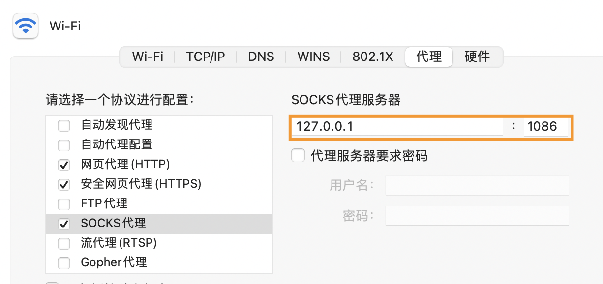

# 从零开始配置React-Native IOS环境
最近开始研究React Native， 没想到在第一步装环境的时候，就因为“网络原因”，遇到各种报错，这里记录一下环境配置上遇到的各种坑。
## 参考官方文档
以前都是习惯于直接参考英文文档，这次因为网络问题，才意识到，[React Native中文网](https://www.reactnative.cn/docs/environment-setup)里面很多坑都给你提前预警了，建议在装环境这一步，直接参考中文网站。

## cocoapods 安装问题
在根据官网文档一步一步安装之后，继续运行命令`sudo gem install cocoapods`来安装cocoapods。因为我是M1芯片的Macbook,所以直接安装会遇到问题。这时候有两个解决办法：
1. 通过brew来安装，执行命令`brew install cocoapods`
2. 参考官方文档中给出的**Mac M1 的注意事项**,安装`ffi包`来在安装和装载 pods 时调用合适的系统架构
```
sudo arch -x86_64 gem install ffi
arch -x86_64 pod install
```
## pod install 太慢的问题
在已经根据官网文档步骤安装好前置环境。使用React Native 内建的命令行工具创建新项目时，我遇到的情况是命令行停在 Installing CocoaPods dependencies 很久，直到20分钟之后timeout。
这时候报错的log会提示你进到项目的ios文件夹内，手动执行`pod install`命令。但依旧会报错，错误信息如下，在`Installing OpenSSL-Universal (1.1.1100)`继续卡住。

```
Installing FlipperKit (0.125.0)
Installing OpenSSL-Universal (1.1.1100)

[!] Error installing OpenSSL-Universal
[!] /usr/bin/curl -f -L -o /var/folders/69/ty_6ybcn3rv5q6s4z2cy9vh00000gn/T/d20220825-15652-5uve5b/file.zip https://github.com/krzyzanowskim/OpenSSL/archive/1.1.1100.zip --create-dirs --netrc-optional --retry 2 -A 'CocoaPods/1.11.3 cocoapods-downloader/1.5.1'

  % Total    % Received % Xferd  Average Speed   Time    Time     Time  Current
                                 Dload  Upload   Total   Spent    Left  Speed
  0     0    0     0    0     0      0      0 --:--:-- --:--:-- --:--:--     0
  7 83.6M    7 6415k    0     0  17205      0  1:25:01  0:06:21  1:18:40   854
curl: (56) LibreSSL SSL_read: error:02FFF036:system library:func(4095):Connection reset by peer, errno 54
```
### 解决办法
我遇到这个问题的原因，在[React Native中文网](https://www.reactnative.cn/docs/environment-setup)其实已经提到了

**CocoaPods 的源必须使用代理访问（镜像源也无效）。如果在 CocoaPods 的依赖安装步骤卡住（命令行停在 Installing CocoaPods dependencies 很久，或各种网络超时重置报错，或在ios目录中无法生成.xcworkspace文件），请务必检查确定你的代理配置是否对命令行有效。**

我的问题就是出在我的代理配置对命令行上没效的，所以即使我已经提前准备了“科学上网”，依旧会在安装依赖的时候没法连接。
1. 检查自己的代理监听的端口，比如说我的是1086。
可以通过：系统偏好设置->网络->高级设置->代理->SOCKS代理来检查

2. 终端输入以下命令，在命令行也添加上github代理
```
git config --global http.proxy socks5://127.0.0.1:1086 
git config --global http.https://github.com.proxy socks5://127.0.0.1:1086
```

3. 这时候再执行 `pod install`，就会一切顺利了。
4. 最后可以执行以下命令取消代理
```
git config --global --unset http.proxy 
git config --global --unset http.https://github.com.proxy 

```

## 总结
其实官方文档已经很详细了，能帮助你从零开始搭建好React Native环境，要注意的点就是按部就班的来，不要跳过或者忽略它的步骤。