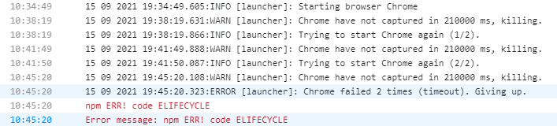

# kamra 遇到 chrome have not captured in 60000 ms killing 的问题

## 问题描述
最近遇到了由于 Chrome 升级到 93。导致我们在 team citys 上面跑`ng test`命令时， 会遇到如下报错， 而在本地确是好的：


这个原因应该是因为 chrome 升级之后，原来装在`%LOCALAPPDATA%/Google/Chrome/Application`位置的 chrome 现在安装在`%PROGRAMFILES%/Google/Chrome/Application`.
然而 karma 继续去根据` LOCALAPPDATA->PROGRAMFILES-> 'PROGRAMFILES(X86)'`的顺序先寻找老的版本并且去启动它。所以会导致这个错误。

## 尝试办法

一开始尝试升级 karma, 但是并不起作用，因为这个本质原因是 chrome 找不到的问题。
之后是通过延长响应时间，但是也不起作用。
noActivityTimeout: 200000,
browserNoActivityTimeout : 210000,

## 最终解决

通过自定义`customLaunchers`来跑 UT。而不是启动真正的 chrome 浏览器

```javascript
browsers: ['HeadlessChrome'],
customLaunchers: {
    HeadlessChrome: {
        base: 'ChromeHeadless',
        flags: ['--no-sandbox']
    }
}
```
