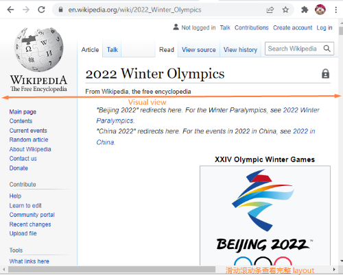

# 了解 viewport meta tag

## 什么是 viewport

viewport, 中文也叫“视口”。在浏览器范畴里，它代表的是在浏览器中，可以看到的网页内容。viewport 外的内容在被滚动进来前都是不可见的。

进一步细分 viewport，当前可见的部分叫做 visual viewport（可视视口）。visual viewport 可能会比 layout viewport（布局视口）更小，因为当用户缩小浏览器缩放比例时，布局视口不变，而可视视口变小了。这导致用户需要横向滑动滚动条才能看到完整的信息。
我们可以用[维基百科的首页](https://en.wikipedia.org/wiki/Main_Page)举例，大家也可以自己点进去缩放浏览器感受一下:

1. 正常情况下，visual viewport = layout viewport。

2. 当我们缩小浏览器比例时，visual viewport < layout viewport。这时候需要滑动下面的滚动条才能看到完整的 layout viewport。
   

## 属性

为了满足 visual viewport = layout viewport 的理想情况，就需要通过 meta 标签来配置 viewport 的不同属性来设计网页。
一般我们用 HTML5 模板生成一个 html 文件时，viewport 会初始化出下面这些属性：
`<meta name="viewport" content="width=device-width, initial-scale=1">`
`content="width=device-width`的意思是让 layout viewport 的宽度等于设备宽度。`initial-scale=1`的意思是允许用户对页面进行缩放。

### viewport的6个属性
1. width: 设置布局窗口的宽度。上面的例子里，我们将其设置为`device-width`。 同时，它也可以设置为指定的数字，`width=960`意思是宽度设置为`960px`。
2. initial-scale: 设置页面的第一次加载时候的缩放和布局窗口的宽度。一般默认值是 1。

3. minimum-scale: 设置最小缩放级别(即用户可以缩小多少)。这就剥夺了用户的控制权，不推荐。

4. maximum-scale: 设置最大缩放级别(即用户可以放大多少)。同样，不建议这样做。

5. user-scalable: 当设置为 `no` 时，将阻止用户缩， 不推荐。

6. height: 应该设置布局 viewport 的高度。任何地方都不支持....所以不确定是否包括在内。

## 参考文章

- [Using the viewport meta tag to control layout on mobile browsers](https://developer.mozilla.org/en-US/docs/Web/HTML/Viewport_meta_tag)
- [A tale of two viewports — part two](https://www.quirksmode.org/mobile/viewports2.html)
- [Viewport Meta Element](https://responsivedesign.is/develop/responsive-html/viewport-meta-element/)