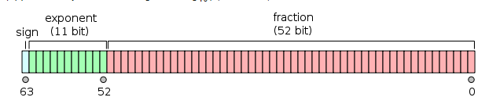

# JavaScript 中的 BigInt 类型

## Number 的安全范围

和别的强类型编程语言(比如说 C，Java)不同，JavaScript 不区分整数值和浮点数值。
我们可以发现`10 === 10.0 // true`。那是因为 JavaScript 的数字类型是基于 IEEE 754 标准中的"双精度"格式，也就是 64 位二进制来实现的，它是通过如下格式来存储数据。

符号位(Sign bit): 1 bit(0 表示正数， 1 表示负数)
指数位(Exponent): 11 bits
有效数字(Significand precision): 53 bits (52 explicitly stored)在二进制中，计算机内部保存有效数字时，第一个有效数字必定是`1`，因此这个`1`并不会存储。所以`52`位有效数字可以存储`53`位。

这里可以提到的的一点是：二进制浮点数最大的问题就是在处理`0.1 + 0.2`的时候，实际上的结果不是`0.3`，而是一个比较接近的数字`0.30000000000000004`,这也是因为在它计算的时候，会先转化为二进制，再进行计算导致的偏差。因为我们在用 JavaScript 或者其他遵循 IEEE 754 规范的语言处理带有效数的数字时要特别注意。

JavaScript 的数字格式也就决定了 JavaScript 能够安全表示的整数范围是 `-2^53+1 ~ 2^53-1`。
这里我们可以先明确一下“安全”的概念:

1. 可以准确地表示为一个 IEEE-754 双精度数字
2. 其 IEEE-754 表示不能是舍入任何其他整数以适应 IEEE-754 表示的结果
   比如说：比如，`2^53 - 1` 是一个安全整数，它能被精确表示，在任何 IEEE-754 舍入模式（rounding mode）下，没有其他整数舍入结果为该整数。作为对比，`2^53` 就不是一个安全整数，它能够使用 IEEE-754 表示，但是 `2^53 + 1` 不能使用 IEEE-754 直接表示，在就近舍入（round-to-nearest）和向零舍入中，会被舍入为 `2^53`。

可以参考[Number.isSafeInteger()](https://developer.mozilla.org/en-US/docs/Web/JavaScript/Reference/Global_Objects/Number/isSafeInteger)的定义。

## BigInt 类型

在 ES2020 之前，JavaScript 只有一种数值类型：number(数字)，而之后为了安全表达比 `-9007199254740991 ~ 9007199254740991`安全范围之外的数字。引入了`BigInt`类型。
一般计算机是将整数存储在 CPU 的寄存器中(现在通常是 32 位或 64 位宽， JS 是 64bit)，或者存储在寄存器大小的内存块中，这就会带来安全范围的问题。而 BigInt 类型为了保证精度。它是在内存中分配一个对象。我们让它足够大，以一系列块的形式容纳所有 BigInt 的位，我们称之为“数字”
https://v8.dev/blog/bigint
## 如何使用
