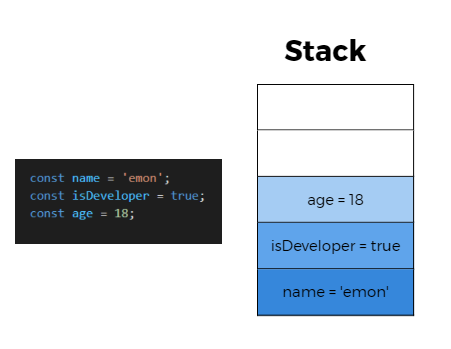
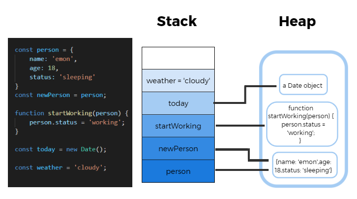
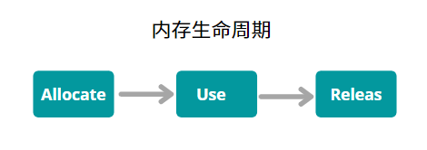
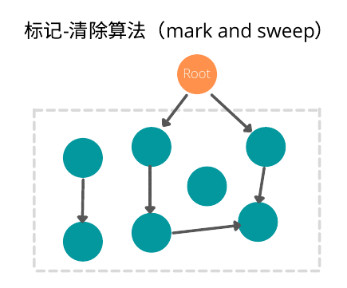

# 理解 JavaScript 中的内存管理（Memory Management）

平时写 JavaScript 代码时候，我们很少会考虑到内存管理（Memory Management)的问题，因为 JS 已经帮我们做了这些事情：

1.  创建变量（对象，字符串等）时自动进行分配内存。
2.  对不再使用的变量“自动”释放，也称垃圾回收（garbage collection）。

    然而，理解 JS 的内存管理，可以在我们遇到内存泄漏问题的时候及时解决，也有助于我们写出更高效的代码。

## 什么是内存

从计算机硬件层面来说，内存是计算机的重要部件之一，它是 CPU 能直接寻址的存储空间。计算机中所有程序的运行都是在内存中进行的。

### 堆内存和栈内存

**栈内存（stack memory：**
栈是 JavaScript 用来存储静态数据的数据结构。静态数据是引擎在编译时知道其大小的数据。在 JavaScript 中，这包括 7 种原始值(Primitive values)(string, number, boolean, bull, undefined, bigInt, symbol)和指向对象和函数的引用。



特点：

1. 栈内存给每个变量分配的内存空间是固定的。也就是说，栈上分配的空间是在编译时由编译器设置的（这个过程也称为“静态内存分配（static memory allocation）”），在程序执行时不会改变。
2. 栈内存的大小也是有限的。
3. 后进先出，存取速度相对于堆内存，更快。

**堆内存(heap memory)：**
堆内存是一个不同的存储数据的空间，JavaScript 在这里存储对象和函数。



特点：

1. 堆内存的大小是在编译过程中动态分配的，这个过程也称“动态内存分配（dynamic memory allocation”
2. 要注意的是，堆内存和数据结构中的堆完全是两码事，分配方式倒是类似于链表。具体可以参考[What's the relationship between "a" heap and "the" heap?](https://stackoverflow.com/questions/756861/whats-the-relationship-between-a-heap-and-the-heap)
3. 存取速度相对比较慢

**静态内存分配&动态内存分配：**

| 静态内存分配             | 动态内存分配                               |
| ------------------------ | ------------------------------------------ |
| 编译时知道内存大小       | 编译时不知道内存大小，在程序运行时按需分配 |
| 编译时进行分配           | 程序运行时进行分配                         |
| 分配栈内存               | 分配相应的堆内存                           |
| FILO(first-in, last-out) | 分配没有特定顺序                           |

## 内存生命周期（Memory life cycle）

内存的生命周期和我们生活中使用工具的情况很像，都是拿，用，还这三个流程。



1.  按需分配内存（Allocate memory)
    分配内存发生在我们初始化一个变量的时候。
2.  使用分配的内存，进行读/写操作（Use memory）
3.  不再需要的时候，释放内存(Release memory)
    当内存不在需要使用的时候，就要进行释放（Release）但是 JS 不像 C 语言,可以通过`malloc()` 和 `free()`函数来进行内存管理，JS 需要依赖“垃圾回收机制”来释放内存

```javascript
var n = 12; // 给Number类型变量n分配栈内存
var o = {
  name: "Emon",
  job: "developer",
}; // 给对象类型变量o分配堆内存进行存储，并把对o的引用存储到栈内存中
```

## 垃圾回收(Garbage collection)

垃圾回收的算法主要是依赖于引用的概念。
引用(Reference)： 在内存管理的环境中，一个对象如果有访问另一个对象的权限，叫做一个对象引用另一个对象。引用包括显示引用(explicitly reference)和隐式引用(implicitly reference)。

```javascript
var emonObj = { name: "emon", dept: "web" }; // emonObj 对它的原型（prototype）有隐式引用
emonObj.name; // emonObj 对象对 name value有显示引用
```

而垃圾回收器就是把我们不再需要的内存的时候，自动释放它。但是这只能是一个近似的过程，因为“某块内存是否仍然需要”的状态是无法判定（undecidable）的，也就是一个算法在有穷时间内无法给出“yes”或“no”答案。
所以判断这个“是否不再需要”的状态，是垃圾回收算法一直在努力考虑和优化的问题。

### 标记-清除算法（Mark-and-sweep algorithm）

自从 2012 之后，所有现代浏览器都使用带了标记-清除垃圾回收算法。它把“对象是否不再需要”简化为“对象是否可以获得”。
它的原理是： 设置一个叫做根的对象（root）（JavaScript 中指的是全局对象）。垃圾回收器将定期从 root 开始，找所有从 root 开始引用的对象，以及引用的引用...最终获得所有可以获得的对象和不能获得的对象，并把不能获得的对象所占用的内存给给释放掉。



当然，它也有个限制，那就是无法从根对象查询到的对象都会被清除。

### 引用计数垃圾收集（Reference-counting garbage collection）

这是一种最简单是垃圾回收算法，它方法把“对象是否不再需要”简化为“没有其他对象引用它”。如果一个对象是零引用，那么它将会被垃圾回收机制回收。

但是这种算法在循环引用的时候不起作用。因此已经被废弃了。这里我们不做过多讨论。

## 内存泄漏（memory leak）

内存泄漏是指：

1. 计算机程序因为某些原因（对存储器配置配置管理失当，疏忽或者错误）造成程序没法是否已经不再使用的内存。
2. 配置给对象的存储器无法被执行程序所访问。
   内存泄漏不是指内存在物理上的消失，而是应用程序分配某段内存之后，由于设计失误，导致在是否该段内存之前就失去了对该段内存的控制，造成内存的浪费。

我们这里会将 4 种常见的内存泄漏例子，你会发现，如果你理解了幕后发生的事情，这些都是可以轻易避免的。

### 全局变量（Global variables）

    把数据存储在全局变量中可能是最常见的内存泄漏。
    如果你用`var`关键字声明一个变量，直接定义一个`function`，或者直接忽略关键字的时候，浏览器引擎会自动把这个变量加到`window`对象里面。

```javascript
function createPerson() {
  // 以下三个变量，看似定义在createPerson方法里，实际存放在window对象里。如果这些数据足够大，则会影响到程序运行速率
  var globalName = "Emon"; // 使用var关键字创建的变量
  this.currentPerson = "me"; //使用this创建的变量，这里的this指向的是window
  globalLastName = "Lu"; //未声明的变量
}
```

#### 解决办法

1. 尽量避免定义全局变量，可以通过使用`let`,`const`关键字来定义变量。
2. 在严格模式下运行代码来避免这种情况。
3. 在创建全局变量之后，确保在不使用它的时候释放掉，可以把它设置为`null`。

### 忘记的定时器或者callback方法
#### 忘记的定时器
特别是针对于单页面应用。如果你使用`setU`


## 参考文档

[JavaScript's Memory Management Explained](https://felixgerschau.com/javascript-memory-management/#memory-life-cycle)

[How JavaScript works: memory management + how to handle 4 common memory leaks](https://blog.sessionstack.com/how-javascript-works-memory-management-how-to-handle-4-common-memory-leaks-3f28b94cfbec)

[Memory Management](https://developer.mozilla.org/en-US/docs/Web/JavaScript/Memory_Management)
