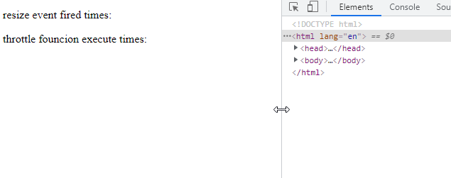
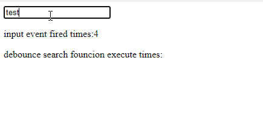

# JavaScript 实现节流函数，防抖函数

节流函数（throttling fountion）和防抖函数（debouncing fountion）都是为了实现一个目的：减少方法被调用的次数，提高网站效率。
   常用于处理一些会被频繁触发的事件， 比如说`keydown, keyup, click, mousemove, resize`等等。

## 节流函数（throttling founction）

举例子说，你在嗑瓜子，每次你都会把瓜子壳扔在地上，而扫地机器人则负责扫地。扫地机器人每过 10 分钟才会转回你丢瓜子壳的区域，进行清扫。当它执行完之后，就离开了，可能去厨房打扫了。这时候，无论你继续丢多少瓜子壳，扫地机器人都不会过来，直到过了 10 分钟之后。
节流函数是只会在指定的时间周期内执行一次。

### 示例

实现监听窗口变化的功能



### 代码实现

```javascript
var previous = 0;
var timeId;
var throttle = function (callback, interval) {
  var now = new Date();
  if (now - previous > interval) {
    // 等当前周期结束之后，再执行
    callback();
    previous = now;
  }
};
// 另一种实现节流的方法
var throttle2 = function (callback, interval) {
  // 如果已经设置了定时任务，那么什么都不需要做
  if (timeId) {
    return;
  }
  // 在一段周期之后，再次设置定时任务
  timeId = setTimeout(() => {
    callback();
    // setTimeout定时方法完成后，把timeId设置为undefined
    timeId = undefined;
  }, interval);
};
```

## 防抖函数（debouncing fountion）

依旧是你在嗑瓜子，但是这次是你妈妈在帮你扫地，她告诉你，等你嗑完这一袋瓜子后叫她，她才会慢悠悠过来帮你扫掉。之前无论你叫她多少次，她听到了，但并不想理你。
防抖函数就是会等事件结束之后，冷却一段时间，才会执行。

### 示例

实现如下根据用户输入进行搜索的功能

     

### 代码实现

```html
<body>
  <input type="text" id="search-input" />
  <p>input event fired times:<span id="fired-times"></span></p>
  <p>
    debounce search founcion execute times:<span id="debounce-times"></span>
  </p>
</body>
```

```javascript
var timerId;
const handleUserInput = function () {
  var firedTimesDom = document.getElementById("fired-times");
  firedTimes = firedTimesDom.innerHTML || 0; // 获取初始fire times
  firedTimesDom.innerHTML = parseInt(firedTimes) + 1; // fire times + 1
  debounce(callSearchApi, 300);
};

var debounce = function (callback, delay) {
  if (timerId) {
    clearTimeout(timerId); // 如果一直在请求，则不会调用
  }
  timerId = setTimeout(callback, delay); // 等请求结束之后，delay一段时间再调用
};

const callSearchApi = function () {
  var debounceSearchTimesDom = document.getElementById("debounce-times");
  debounceSearchTimes = debounceSearchTimesDom.innerHTML || 0; // 获取初始debounce search times
  debounceSearchTimesDom.innerHTML = parseInt(debounceSearchTimes) + 1; // debounce search times + 1
};
const inputBox = document.getElementById("search-input");
inputBox.addEventListener("input", handleUserInput); // input添加监听事件
```

## 总结

| 函数名   | 区别                                             | 适用场景                                                                                                                           |
| -------- | ------------------------------------------------ | ---------------------------------------------------------------------------------------------------------------------------------- |
| 节流函数 | 无论事件触发多少次，它只会定期执行，没有延迟时间 | 适用于只关心最后状态的情况，比如说输入搜索功能，需要等待用户停止输入来获取预先输入的搜索结果                                       |
| 防抖函数 | 在事件结束的时候延迟执行                         | 适用于需要知道所有中间状态时。例如在用户调整窗口大小时跟踪屏幕宽度，并在页面内容发生变化时重新安排页面内容，而不是等到用户完成操作 |
