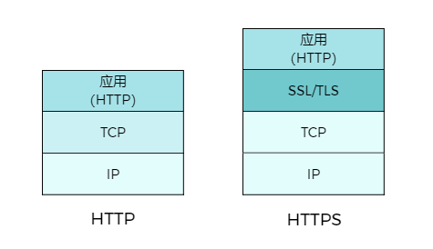

# HTTP 和 HTTPS 的区别

## HTTP 简介

HTTP(**H**yper**T**ext **T**ransfer **P**rotocol)，又称为**超文本传输协议**。
1898 年，Tim Berners-Lee 在 CERN（欧洲核子研究组织）提出了一种能让远隔两地的研究者们共享知识的设想，也就是后来的万维网。HTTP 也由此开始发展。

## TCP/IP 协议族(TCP/IP Protocols)

### 简介

计算机和网络之间要实现信息传输，双方就要约定好通信的标准和方法。比如说怎么发起/结束通信，由那一边先发起，使用什么方法，什么语言等等。而这些为通信而制定的规则，我们称为协议（proticol）。TCP/IP 协议族（TCP/IP Protocol Suite，或 TCP/IP Protocols）则是这些网络传输协议家族的统称，这是因为协议族中的两个核心写于 TCP 和 IP，为该家族在最早通过的标准。

### 分层管理

TCP/IP 协议在一定程度上参考了 OSI 模型(Open System Interconnection Model)的体系结构。OSI 模型共有七层，从下到上分别是物理层、数据链路层、网络层、运输层、会话层、表示层和应用层。但是这显然是有些复杂的，所以在 TCP/IP 协议中，它们被简化为了四个层次，我们叫它 TCP/IP 模型，它也被看做简化的 OSI 模型。而 HTTP 协议就是位于应用层的一种协议。

| OSI 层号 | OSC 层次名                     | TCP/IP 层号 | TCP/IP 层次名                      | 封装单元 | TCP/IP 协议                              |
| -------- | ------------------------------ | ----------- | ---------------------------------- | -------- | ---------------------------------------- |
| 7        | 应用层（Application Layer）    | 4           | 应用层（Application Layer）        | 数据     | HTTP, FTP, TFTP, DNS, Telent, IMAP, SMTP |
| 6        | 表示层（Presentation Layer）   |             | ^^                                 | 数据     | ^^                                       |
| 5        | 会话层（Session Layer）        |             | ^^                                 | 数据     | ^^                                       |
| 4        | 传输层（Transport Layer）      | 3           | 传输层（Transport Layer）          | 报文段   | TCP, UDP, RTP, SCTP                      |
| 3        | 网络层（Network Layer）        | 2           | 互联网层（Internet Layer）         | 数据包   | IP                                       |
| 2        | 数据链路层 （Data Link Layer） | 1           | 网络接口层（Network Access Layer） | 帧       |                                          |
| 1        | 物理层（Physical Layer）       |             | ^^                                 | 比特     |                                          |

## HTTP 版本历史

### HTTP/0.9

HTTP 于 1990 年问世，那时候 HTTP 并没有被做完正式的标准被建立，因此被称为 HTTP/0.9。

### HTTP/1.0

1996 年的 5 月，HTTP 正式作为标准被公布。这是第一个在通讯中指定版本号的 HTTP 协议版本。

### HTTP/1.1

HTTP/1.1 于 1997 年 1 月公布，弥补了之前版本的很多不足。
HTTP/1.1 相较于 HTTP/1.0 协议的区别主要体现在：

- 缓存处理
- 带宽优化及网络连接的使用
- 错误通知的管理
- 消息在网络中的发送
- 互联网地址的维护
- 安全性及完整性

### HTTP/2

于 2015 年 5 月作为互联网标准正式发布, 是目前的主流版本（截至到写这篇文章的 2021 年 11 月）。

### HTTP/3

HTTP/3 是即将到来的第三个主要版本的 HTTP 协议，和之前的 1.1 和 2 不同，在 HTTP/3 中，将弃用 TCP 协议，改为使用基于 UDP 协议的 QUIC 协议实现。

## HTTP 缺点

1. HTTP 本身不具备加密功能，导致通信使用明文（不加密），内容可能会被窃听
2. 不验证通信方的身份，因此有可能遭遇伪装
3. 无法证明报文的完整性，所以有可能已遭篡改

参考：《图解 HTTP》

## HTTPS

HTTPS(HTTP Secure)也叫“超文本传输安全协议”，但它不是应用层的一种新协议，而是经由 HTTP 进行通讯，但是在 HTTP 通信接口部分用 SSL/TLS 协议代替。简而言之，HTTPS 是在 HTTP 的基础上，加了 SSL/TSL 协议这层外壳， 也拥有了身份验证，加密，证书和完整性保护这些功能。

## SSL/TSL 简介

### 什么是 SSL

SSL（Secure Sockets Layer)。是由网景公司设计的主要用于 WEB 的安全传输协议。它的基础算法是网景公司的首席科学家 Taher Elgamal 编写，他也由此被称为“SSL 之父”。
SSL 协议在 1999 年 TLS 1.0 发布时就已被弃用，但仍然经常将这些相关技术称为“SSL”或“SSL/TLS”。

### 什么是 TSL

TSL(Transport Layer Security),传输层安全协议是 SSL 的后继者。IETF（Internet Engineering Task Force）将 SSL 标准化，并命名为 TLS。

### SSL 证书

SSL 证书（也称 TLS 或者 SSL/TLS 证书）是一种数字文档，

## 使用场景

HTTPS 和 HTTP 的主要区别就是安全和速度。
安全： HTTPS>HTTP
速度： HTTPS<\HTTP

1. 如果你的网站不是商业性质的，或者你不需要考虑网站访问者提交的敏感信息，比如说密码，身份信息等等。你可以考虑只用 HTTP
2. HTTPS 除了在安全上有绝对优势，如果你的网站需要做 SEO。也请用 HTTPS。很多搜索引擎会忽略甚至屏蔽 HTTP 的网站。
