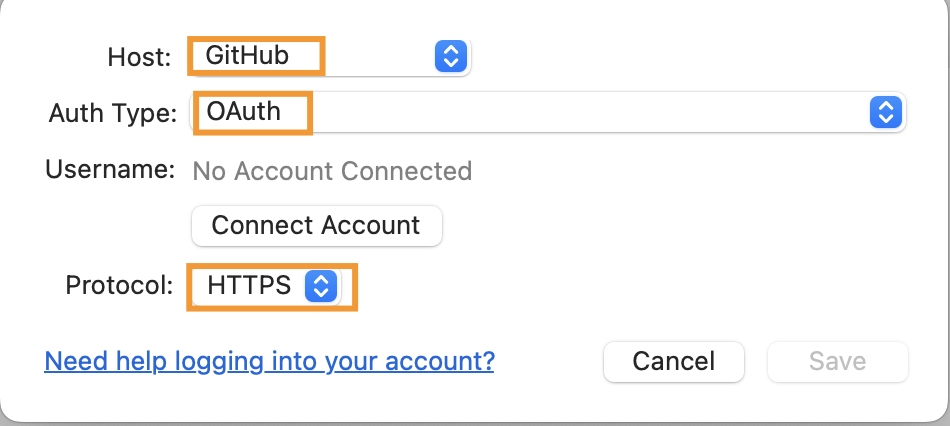
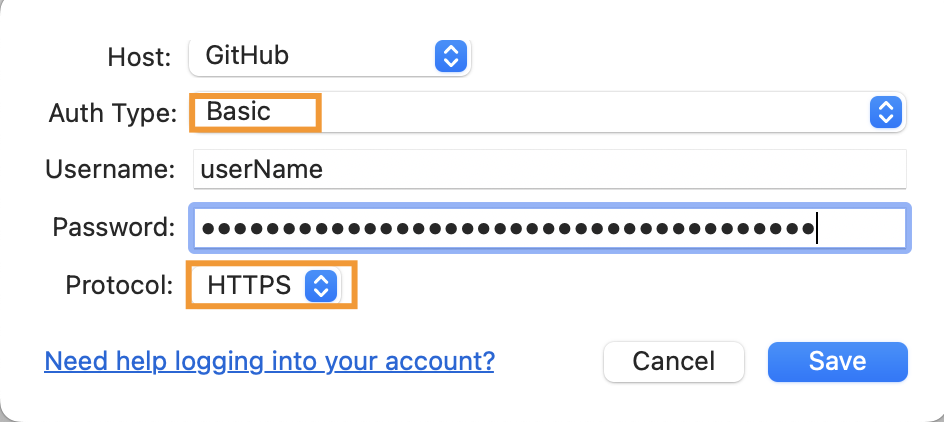
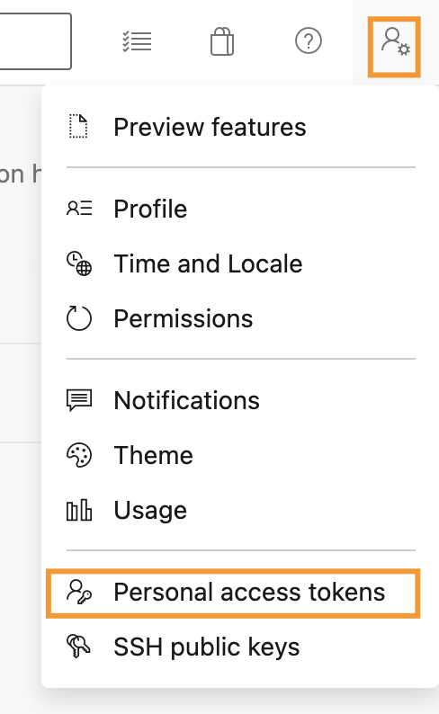
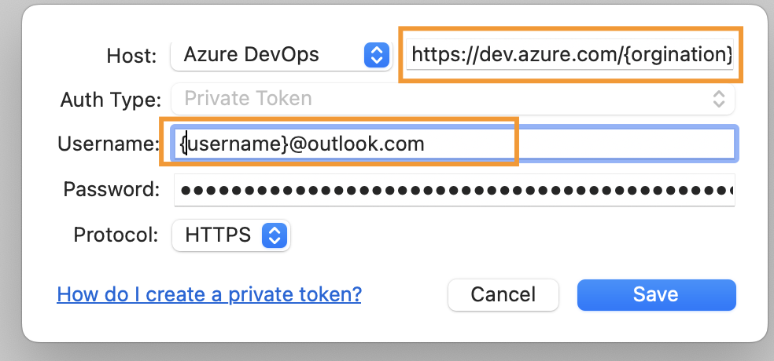

# MAC 在sourceTree中添加账号
## SourceTree简介
SourceTree 是一个git图形界面工具(GUI， graphical user interface), 但同时，SourceTree 支持 Bitbucket、GitHub 以及 Gitlab， Azure Devops等远程仓库。
下载sourceTree可以直接从官网上下载： [www.sourcetreeapp.com](https://www.sourcetreeapp.com/)

## SourceTree 上添加git账号

打开`SourceTree -> Perferences -> Accounts`. 点击`Add`, 就可以添加账号了。
1. 通过OAuth的方式添加账号。

    - 按照上图所示选择好`Host`, `Auth Type`和`Protocol`。
    - 提前在浏览器上登录好Git账号，再点击`Connect Account`。SourceTree会自动跳转到浏览器获取git auth token。然后填充好Username, 最后点击Save就添加好了

2. 通过Baic方式添加账号

当Auth Type选择的是Basic的时候，需要用户输入Username和Password。
- `Username`就是你git账号的Username
- 对于`Password`，需要在Git上创建一个Personal access toke。
- 在浏览器上登录git账号，点击`Settings -> Developer settings -> Personal access token -> Generate new token`
- 将生成的`Personal access token`复制到上图中Password的地方，点击`Add`，就可以顺利添加账号了。
#
# SourceTree 上添加Azure Devops账号
和Git添加账号一样，都是不能直接使用密码添加的，Azure Devops要求你提前生成一个Person Access Token，简称PAT。
- 生成PAT，点击`User settings ->  Personal access tokens -> New Token`，进行设置权限之后，点击`Create`可以生成PAT。要注意的是生成的PAT要注意报错，之后就没法在看到了。

- 在SourceTree上添加账号。下面有几个要注意的点：
    - Host地址是https://dev.azure.com/{{orgination}}
    - Username是你登录Azure devops的邮箱
    - Password里面填PAT token
    - Protocol选择HTTPS
