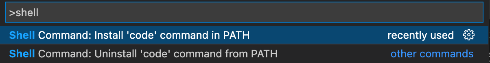
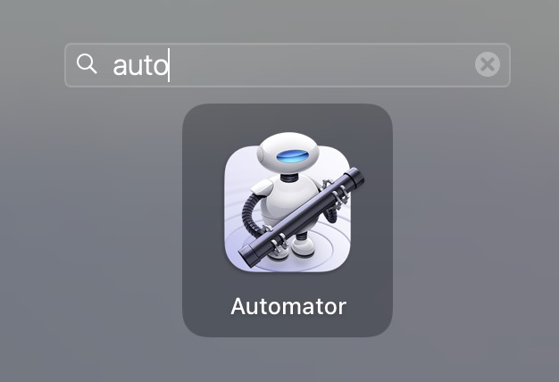
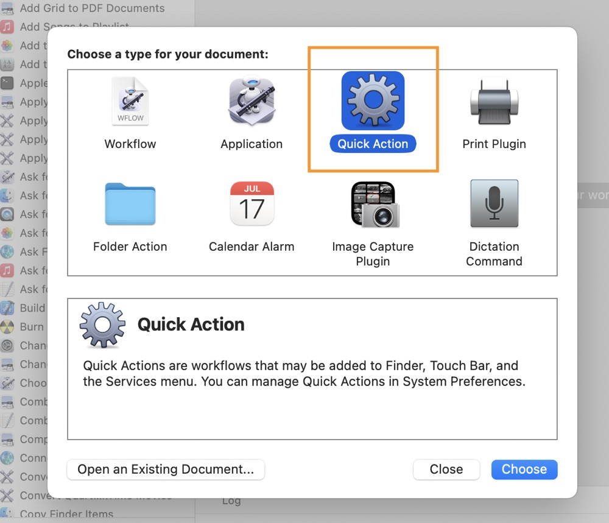
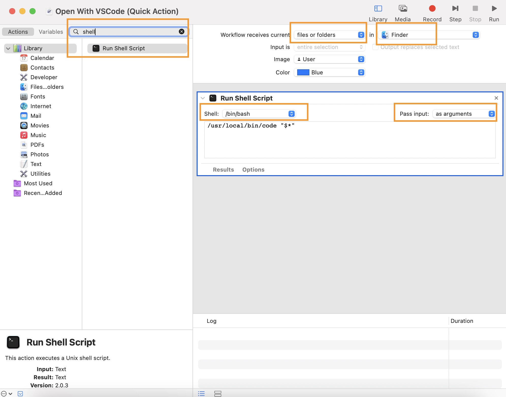
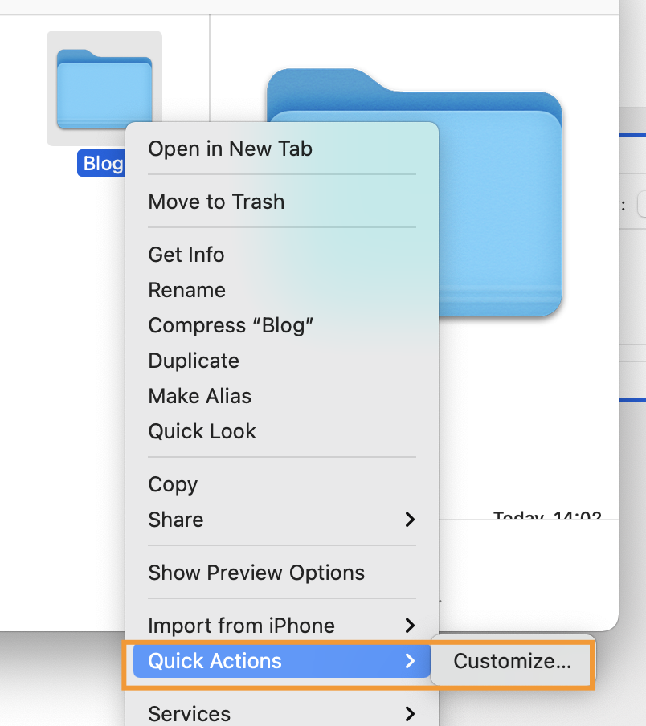
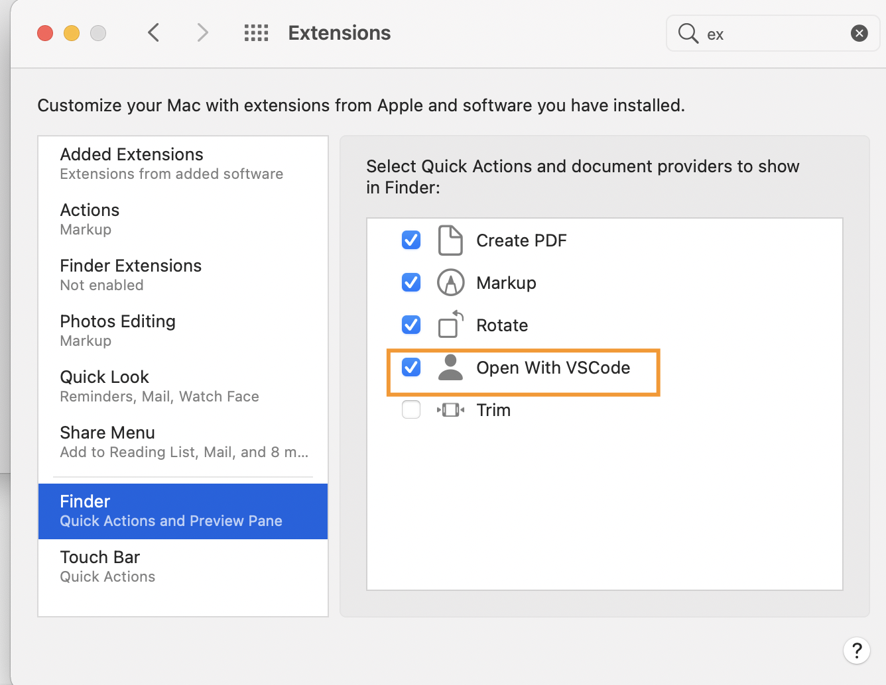

# macos为VS Code设置快捷方式
visuall Studio Code是开发中常用的代码编辑工具，但是在mac上面，想要右键文件夹来直接打开，需要进行配置。
## 初始配置
1. 安装好VS Code
2. `Cmd+Shift+P`打开控制面板，查找到 `Shell Command Install 'code' command in PATH command`
,进行安装。安装好了之后了，我们就可以在终端通过`code .`来打开文件夹了。
，
## 为VS Code创建快捷方式
1. 打开“Automator(自动操作)”,在弹出的界面中“快速操作(quick action)”。

2.左边查找到“运行 shell 脚本(run shell script)”,右边的字段选如下信息：

3. 输入代码`/usr/local/bin/code "$*"`, 按`cmd+s`保存。名字可以自定义，我输入的是“Open with VSCode”.
4. 系统偏好设置里面把Open with VSCode加一下。之后右键文件夹，就可以直接从VS Code里打开了。
      

   